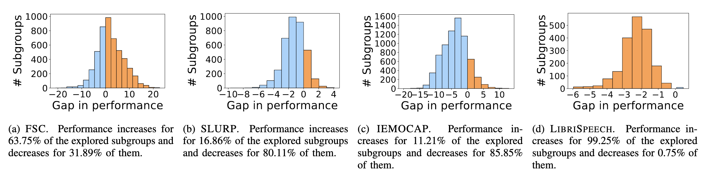
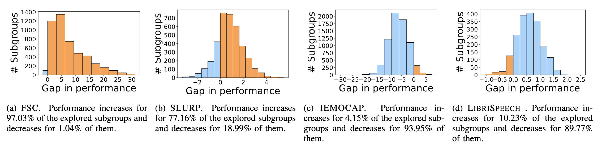

# Towards Comprehensive Subgroup Performance Analysis in Speech Models
This repo contains the code for "Towards Comprehensive Subgroup Performance Analysis in Speech Models", submitted to the IEEE/ACM Transactions on Audio, Speech, and Language Processing (TASLP) journal.

In this repository, you will find the code to replicate our experiments.  

We do not include the datasets ([FSC](https://fluent.ai/fluent-speech-commands-a-dataset-for-spoken-language-understanding-research/), [SLURP](https://github.com/pswietojanski/slurp), [IEMOCAP](https://sail.usc.edu/iemocap/), [LibriSpeech](https://www.openslr.org/12)) used in the paper as they are publicly available and downloadable from the official sites (except for [IEMOCAP](https://sail.usc.edu/iemocap/), for which a request must be made).

## Get Started
Our code was tested on Python 3.10.8. To make it work, you will need a working environment with the libraries listed in `requirements.txt`.

## Running the Experiments
To reproduce the paper's experiments, use the `divexplorer_analysis_{name_dataset}.ipynb` notebook, which leverages the files already computed in `data_precomputed/{name_dataset}`. 

## Our Methodology

In this work we study the presence of bias in spoken language understanding (SLU) model performance on data subgroups. We automatically identify those combinations
of metadata values yielding maximal:
- **Intra-model performance gap**, i.e., a significant difference in performance between the overall dataset and the data subgroup. We quantify it by means of an established
*divergence* metric, or
- **Cross-model performance gap**, i.e., a significant gap in the subgroup performance of models different in size, architecture, or pre-training objectives.

Evaluating intra-model subgroup divergence allows a more nuanced analysis of subgroup performance within a specific SLU model, whereas estimating cross-model gaps can guide
end-users in choosing the best SLU model to use on a proprietary dataset.

We present a novel methodology for automating the characterization and comparison of metadata-generated subgroups. The number of subgroups grows exponentially with the number of metadata attributes. Hence, it becomes infeasible to enumerate and evaluate them using naive approaches. 
Our proposed approach capitalizes on the [recent advancements in model bias analysis](https://ieeexplore.ieee.org/abstract/document/10095284) to address this challenge. The critical insight lies in recognizing that although the number of subgroups is exponential, the number of subgroups that exceed a certain coverage threshold (e.g.,
containing at least 0.1% of the dataset) is generally manageable. 
These subgroups, called *frequent subgroups*, possess practical and statistical significance. On top of the generated patterns, we shortlist the subgroups with maximal **intra- and cross-model gaps**. They respectively provide end-users with explainable representations of problematic subgroups within a given SLU task and across different (but comparable) SLU models.

## What can we do 

In this work, we aim to answer the following Research Questions (RQs).

**RQ1. How can we automatically identify and describe the most problematic subgroups for a given combination of SLU model, dataset, and task?**

We can apply our methodology to detect subgroups that *diverge* for the average behavior. The following table considers for example the **wav2vec 2.0 base model** and all datasets in analysis (FSC, SLURP, IEMOCAP, LibriSpeech), highlighting the most negatively and positively divergent subgroups for each dataset, with their corresponding $f$ and $\Delta f$ values, training and test supports.

| **$Dataset$** | **$Subgroups$** | **$Sup_{train}$** | **$Sup_{test}$** | **$f$** | **$\Delta_f$** | **$t_{value}$** | 
|:-----------:|:---------------------------------------------------:|:-------------:|:------------:|:-------:|:------:|:------:|
|  **FSC**        | S-: \{``age=22-40, gender=male, location=none, speaking rate=high, tot silence=high``\}   S+: \{``age=22-40, location=washroom, speaking rate=low, trimmed duration=high``\}  | 0.03   0.03 | 0.04   0.03 | 60.50   100.0 | -31.22   8.28 | 7.05   9.74 |
|  **SLURP**      | S-: \{``action=quirky``\}   S+: \{``gender=female, scenario=weather``\}  | 0.04   0.03 | 0.05   0.03 | 67.37   95.93 | -19.50   9.07 | 10.27   8.32 |
|  **IEMOCAP**    | S-: \{``label=happy, activation=low``\}   S+: \{``label=sad, valence=low, tot silence=low, trimmed duration=high``\}  | 0.03   0.03 | 0.03   0.03 | 44.74   98.57 | -29.92   23.92 | 7.37   17.01 |
| **LibriSpeech** | S-: \{``gender=female, trimmed speaking rate=high, trimmed duration=low, num pauses=low``\}   S+: \{``gender=female, speaking rate=low, trimmed speaking rate=low, num pauses=low, tot duration=medium``\}  | 0.05   0.03 | 0.03   0.03 | 17.30   3.27 | 11.24   -2.79 | 4.16   5.57 |

**RQ2. What is the effect of the model size on subgroup performance? Does The large the better hold true?**

Larger machine learning models are generally more accurate than smaller one. We demonstrate that increasing the size of a model does not always lead to better performance on a given dataset, as there may be subgroups within the data for which the model’s performance decreases. 
The following table summarizes the performance gap when scaling up the model size of **wav2vec 2.0** for each considered dataset, highlighting the subgroups with the highest performance improvement and the highest decrease.

| **$Dataset$** | **$Subgroups$** | **$Sup$** | **$gain f$** | **$w2v2-b \, f$** | **$w2v2-l \, f$** | **$t_{value}$** |
|:-----------:|:-----------------:|:---------:|:------------:|:--------------:|:--------------:|:--------------:|
|  **FSC**        | $\uparrow$ \{``action=increase, location=none, tot duration=low, trimmed speaking rate=low, trimmed duration=low``\}   $\downarrow$ \{``action=activate, gender=male, speaking rate=low``\} | 0.04   0.03 | 22.69   -20.97 | 75.63   96.77 | 98.32   75.81 | 2.98   4.62 |
|  **SLURP**        | $\uparrow$ \{``gender=female, speaking rate=high, trimmed speaking rate=high, trimmed duration=low``\}   $\downarrow$ \{``action=remove, num words=low``\} | 0.04   0.03 | 4.08   -9.74 | 83.88   92.64 | 87.96   82.90 | 2.85   4.23 |
|  **IEMOCAP**      | $\uparrow$ \{``label=happy, trimmed speaking rate=low``\}   $\downarrow$ \{``label=sad, trimmed speaking rate=low``\} | 0.04   0.03 | 12.96   -19.86 | 67.28   70.55 | 80.25   50.68 | 2.73   4.94 |
| **LibriSpeech**   | $\uparrow$ \{``gender=female, num pauses=low, trimmed speaking rate=high, trimmed duration=low``\}   $\downarrow$ \{``gender=male, num pauses=low, tot duration=low, trimmed speaking rate=high, trimmed duration=low``\} | 0.03   0.04 | -5.97   0.46 | 17.30   10.17 | 11.33   10.64 | 2.52   3.13 |

We can also see the gap contribution when scaling up wav2vec 2.0, considering all the datasets, as shown in the figure below.

    

**RQ3. Is the performance bias on specific subgroups independent of the model architecture?**

We adopt the proposed methodology to evaluate the performance enhancement obtained by replacing a particular model architecture with a different one. Specifically, we evaluate the performance gaps obtained by replacing the **wav2vec 2.0 base** model with the **HuBERT base** model. We show that even when the overall performance increases when one model is adopted instead of another, there can be subgroups where it decreases. 
The following table outlines the performance gap when changing the models’ architecture highlighting the subgroups with the highest performance improvement and the highest decrease

| **$Dataset$** | **$Subgroups$** | **$Sup$** | **$gain f$** | **$w2v2-b \, f$** | **$hub-b \, f$** | **$t_{value}$** |
|:-----------:|:-----------------:|:---------:|:------------:|:--------------:|:--------------:|:--------------:|
|  **FSC**        | $\uparrow$ \{``gender=male, location=none, num words=low, tot silence=high, trimmed duration=low``\}   $\downarrow$ \{``action=decrease, age=22-40, location=washroom``\} | 0.03   0.03 | 31.20   -1.68 | 64.00   100.00 | 95.20   98.32 | 6.54   8.00 |
|  **SLURP**        | $\uparrow$ \{``field=far, gender=male, tot duration=high, tot silence=low, trimmed duration=high``\}   $\downarrow$ \{``field=far, gender=female, speaking rate=low, tot duration=low, tot silence=low``\} | 0.03   0.04 | 5.46   -3.27 | 80.76   85.81 | 86.22   82.53 | 3.21   2.95 |
|  **IEMOCAP**      | $\uparrow$ \{``activation=high, label=anger, duration=low, valence=low``\}   $\downarrow$ \{``label=sad, trimmed speaking rate=low``\} | 0.03   0.03 | 7.54   -30.14 | 75.34   70.55 | 82.88   40.41 | 4.70   6.59 |
| **LibriSpeech**   | $\uparrow$ \{``num pauses=medium, speaking rate=medium, tot duration=medium, tot silence=medium``\}   $\downarrow$ \{``gender=male, num pauses=low, num words=low, tot silence=medium``\} | 0.04   0.03 | -1.05   2.50 | 7.44   7.60 | 6.39   10.11 | 2.53   2.59 |

We can visualize the gap contribution when changing the wav2vec 2.0 base model with the HuBERT base model, considering all the datasets, as shown in the figure below.

    

**RQ4. Are multilingual SLU models more sensitive to subgroup performance bias than monolingual ones?**

We investigate the impact of the multi-lingual pre-training objective on model behavior. Specifically, we compare the performance of three large models, namely the **mono-lingual wav2vec 2.0** model and the **multi-lingual XLSR-53 and XLSR-128** models, on the FSC dataset.
The following Table reports the highest performance improvement and the most highest decrease when changing the models’ pre-training objective from mono- to multi-lingual.

| **$Dataset$** | **$Subgroups$** | **$Sup$** | **$gain f$** | **$mono-b \, f$** | **$XLSR-53 \, f$** | **$t_{value}$** |
|:-----------:|:-----------------:|:---------:|:------------:|:--------------:|:--------------:|:--------------:|
|  **FSC**        | $\uparrow$ \{``action=activate, gender=male, trimmed speaking rate=low``\}   $\downarrow$ \{``action=increase, object=heat, trimmed speaking rate=medium, trimmed duration=high``\} | 0.04   0.03 | 23.84   -55.83 | 74.83   96.67 | 98.68   40.83 | 11.00   6.55 |
| **$Dataset$** | **$Subgroups$** | **$Sup$** | **$gain f$** | **$mono-b \, f$** | **$XLSR-128 \, f$** | **$t_{value}$** |
|  **FSC**        | $\uparrow$ \{``gender=male, speaking rate=high, tot silence=high, trimmed duration=low, location=none``\}   $\downarrow$ \{``action=increase, object=heat, age=22-40, gender=male, tot silence=low``\} | 0.03   0.04 | 24.06   -4.51 | 75.19   98.50 | 99.25   93.98 | 4.90   3.48 |

We can finally observe the gap contribution when changing the pre-training objective, from mono- to multi-lingual, on the FSC dataset, as shown in the figure below.

    

## License
This code is released under the Apache 2.0 license. See the [LICENSE](LICENSE) file for more details.

## Contact
For any questions, please contact [Alkis Koudounas](mailto:alkis.koudounas@polito.it).
